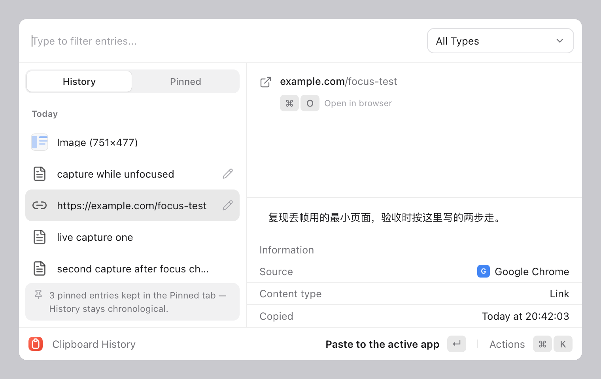
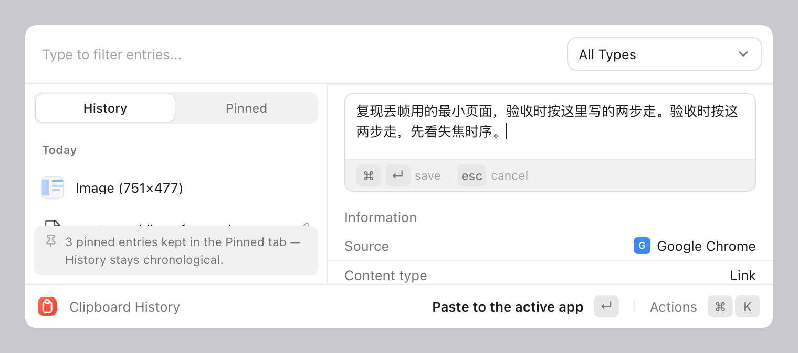
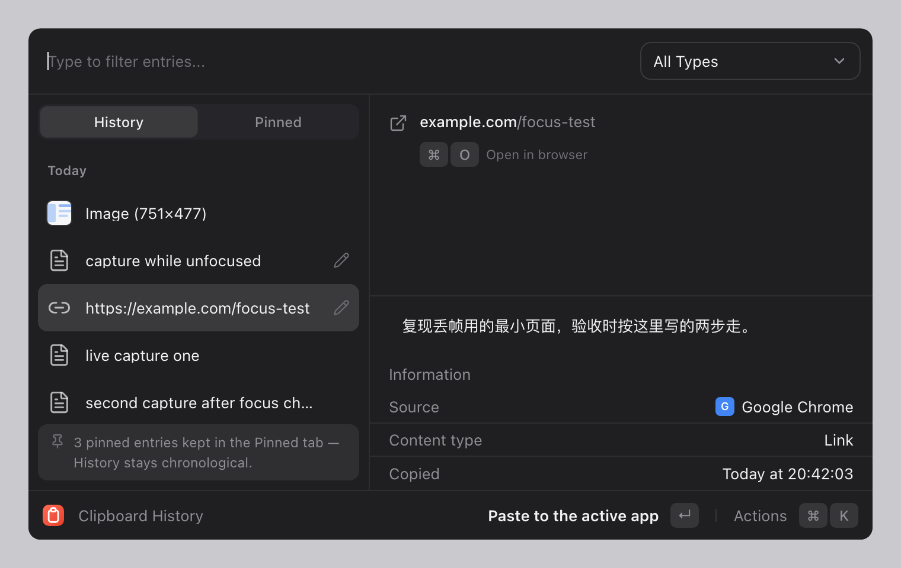

<div align="center">

# Clipboard History

**A clipboard history panel for macOS.** One hotkey, and everything you copied
is there — searchable, pinnable, and pasteable straight back into whatever you
were working in.

Built with Tauri 2 · React 19 · Rust · SQLite

[](https://github.com/navms/clipboard/actions/workflows/ci.yml)
[](https://github.com/navms/clipboard/actions/workflows/release.yml)
[](LICENSE)
[](https://www.apple.com/macos/)
[](https://en.wikipedia.org/wiki/Apple_silicon)

</div>

---

<p align="center">
  
</p>

## Why

You copy something. Twenty seconds later you want it back. It is gone.

Raycast has clipboard history, but it is one tab among twenty. PastePal and
Maccy are single-purpose but cost you a window, a preference pane, or both.
Clipboard History is one floating panel on a global hotkey, backed by a local
SQLite file, with nothing to log into and no network calls at all.

## What it does

**Captures as you work**

- Watches the pasteboard in the background, no shortcut required
- Classifies each capture as text, image, color, link, or file
- Attributes every entry to the app it came from
- Deduplicates by content hash — re-copying the same text bumps the existing
  entry to the top instead of piling up duplicates
- A capture on a large screenshot does not stall the next one: the pasteboard
  read happens on the watcher thread and the encoding on a worker

**Finds it again**

- Fuzzy search over titles *and* notes
- Grouped by Today / Yesterday / Earlier
- Filter by content type
- Pin what you keep, in a separate shelf
- Notes: a per-entry line of your own text, so you can remember *why* you kept
  something

<p align="center">
  
</p>

**Pastes it back**

- Puts the entry back into the app you were just using
- Falls back to clipboard-only when auto-paste is not possible
- Whole thing is keyboard-driven

**Stays out of the way**

- Menu-bar only: no Dock icon, no window in the ⌘-Tab switcher
- Light, dark, and follow-the-system themes
- Optional launch at login
- History that survives a restart

## Screenshots

| Light | Dark |
|---|---|
|  |  |

## Install

### Download a release

Grab the `.dmg` from [Releases](https://github.com/navms/clipboard/releases),
drag **Clipboard History** into `/Applications`, and launch it.

The build is code-signed but **not notarized**, so Gatekeeper stops the first
open. Either:

- right-click the app → **Open** → **Open**, or
- run `xattr -dr com.apple.quarantine "/Applications/Clipboard History.app"`

Both are one-time. After that it opens normally.

> **Apple Silicon only.** The release is arm64, so it will not run on an Intel
> Mac. Building from source on an Intel Mac works but is untested.
>
> No `LSMinimumSystemVersion` is set in the bundle, so macOS will run it on
> whatever it considers old enough. Treat the platform as "a recent macOS on
> Apple Silicon" — the panel is built against current AppKit and has not been
> tested on anything older than what CI runs.

### Homebrew

```sh
brew install --cask clipboard-history
```

### From source

You will need Node 22+, pnpm 12+, and a stable Rust toolchain.

```sh
git clone git@github.com:navms/clipboard.git
cd clipboard
pnpm install
pnpm tauri build          # bundles .app + .dmg under src-tauri/target/release/bundle
```

Note that `cargo` is often not on your PATH after a default rustup install. If
you get "command not found":

```sh
export PATH="$HOME/.cargo/bin:$PATH"
```

## Using it

| Shortcut | Does |
|---|---|
| <kbd>⌥</kbd><kbd>⌘</kbd><kbd>V</kbd> | Show the panel (configurable) |
| Double-tap <kbd>⌥</kbd> | Show the panel — needs Accessibility permission |
| <kbd>↑</kbd> <kbd>↓</kbd> | Move the selection |
| <kbd>↵</kbd> | Paste into the target app |
| <kbd>⌘</kbd><kbd>↵</kbd> | Save a note while editing it |
| <kbd>⌘</kbd><kbd>D</kbd> | Edit the note on the selected entry |
| <kbd>⌘</kbd><kbd>K</kbd> | Actions menu |
| <kbd>⌘</kbd><kbd>P</kbd> | Pin / unpin |
| <kbd>⌘</kbd><kbd>O</kbd> | Open a link, or reveal a file in Finder |
| <kbd>⌘</kbd><kbd>1</kbd> / <kbd>⌘</kbd><kbd>2</kbd> | History / Pinned |
| <kbd>esc</kbd> | Close the panel |

### Accessibility permission

**If the panel does not open when you press the hotkey, this is almost always
why.**

Double-tap-<kbd>⌥</kbd> and auto-paste both need the app to observe and
synthesize key events. macOS gates that behind Accessibility, and it is granted
per-app rather than system-wide.

Go to **System Settings → Privacy & Security → Accessibility** and enable
**Clipboard History**. It takes effect immediately — no restart.

Two details worth knowing:

- The grant is bound to the app's *code signature*, not to its bundle ID. An
  ad-hoc signed build changes signature on every recompile, so the grant lapses
  and those features silently stop working. That is why release builds are
  signed with a stable identity, and why `pnpm reinstall` refuses to install an
  ad-hoc-signed bundle.
- The default <kbd>⌥</kbd><kbd>⌘</kbd><kbd>V</kbd> hotkey does **not** need this
  permission. Use it to check whether Accessibility is the problem.

## How it works

```
pasteboard ─▶ watcher thread ─▶ worker thread ─▶ SQLite
              (snapshot only)   (classify,        │
                                hash, persist)   ▼
                                              React panel
```

The split matters. The pasteboard has to be read *synchronously* inside the
watcher's callback — defer it and a second copy overwrites the first, losing
whatever was in between. Everything after that (hashing, thumbnail generation,
PNG encoding, the database write) happens on a worker, so a burst of
<kbd>⌘</kbd><kbd>C</kbd> does not drop intermediate captures.

Entries are deduplicated with BLAKE3 over a normalized form of the content, and
the re-capture path touches only timestamps — so a note you attached survives
you copying the same thing again.

## Tech stack

**Frontend** — React 19, TypeScript 6, Vite 8, Tailwind CSS 4, zustand,
@tanstack/react-virtual, Fuse.js, lucide-react

**Backend** — Rust with Tauri 2; `rusqlite` (bundled SQLite) for persistence,
`clipboard-rs` for watching, `objc2` / `objc2-app-kit` / `objc2-core-graphics`
for the AppKit-level work (activating the target app, synthesizing
<kbd>⌘</kbd><kbd>V</kbd>, placing the panel)

## Contributing

Read [CONTRIBUTING.md](CONTRIBUTING.md) — it covers the branch model, the commit
conventions, and the three commands CI will run against your change.

## Security

See [SECURITY.md](SECURITY.md). Notably: no network calls, and the clipboard
history is stored in plain SQLite under your own user account.

## License

[MIT](LICENSE) © 2026 何锦
